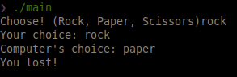

# Description
Just a simple rock paper scissors game written in C.
# Demo 

# Installation
### Building from source
1. Run build.sh or just build main.c
2. (optional) Rename the executable
3. Launch the executable from your terminal emulator of choice!
### Download the release!
1. Navigate to the [releases page](https://github.com/shifter2015/RockPaperScissors_in_C/releases)
2. Download the version corresponding to your system
3. Run!
